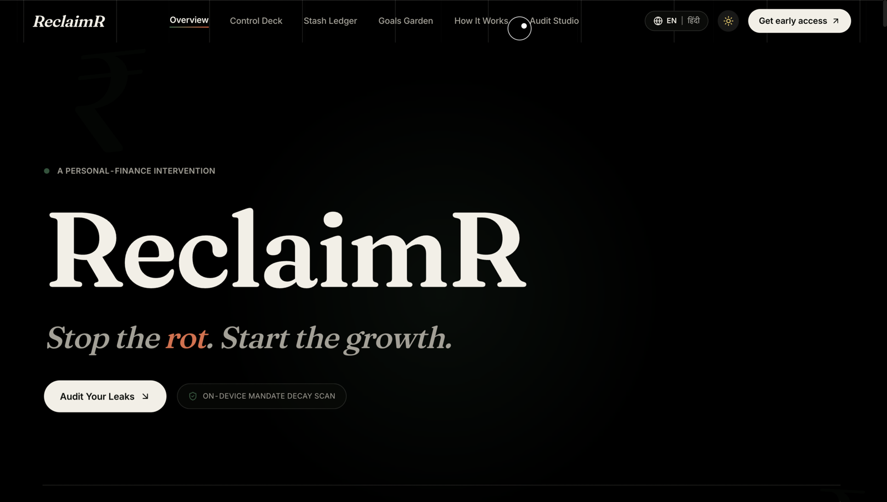
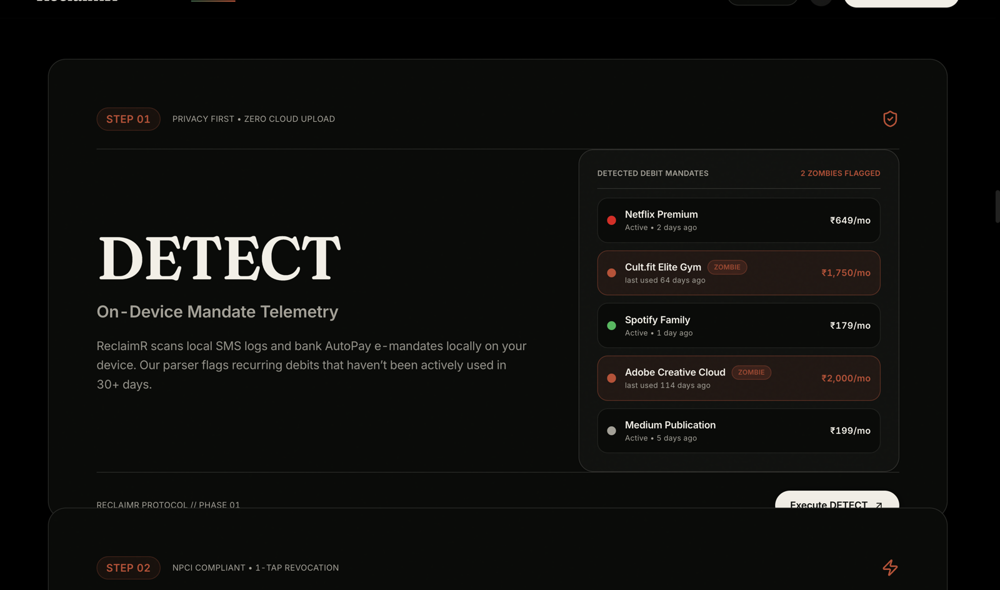
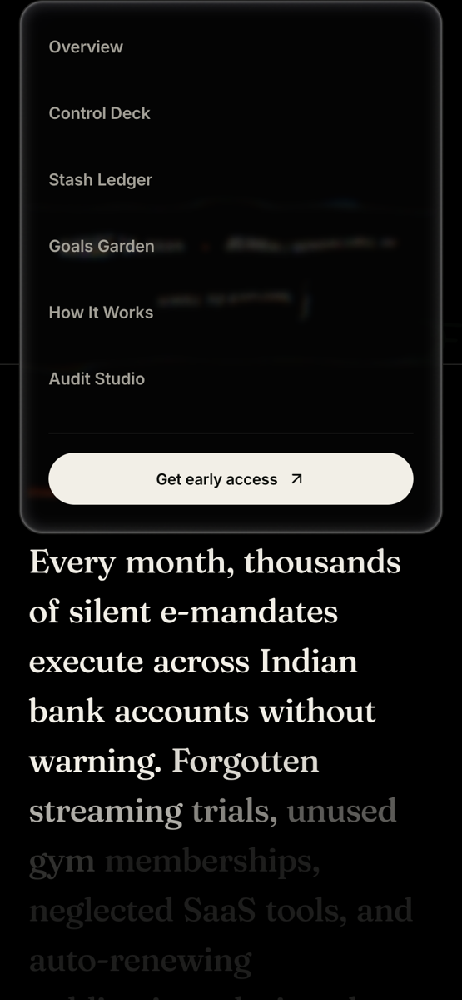
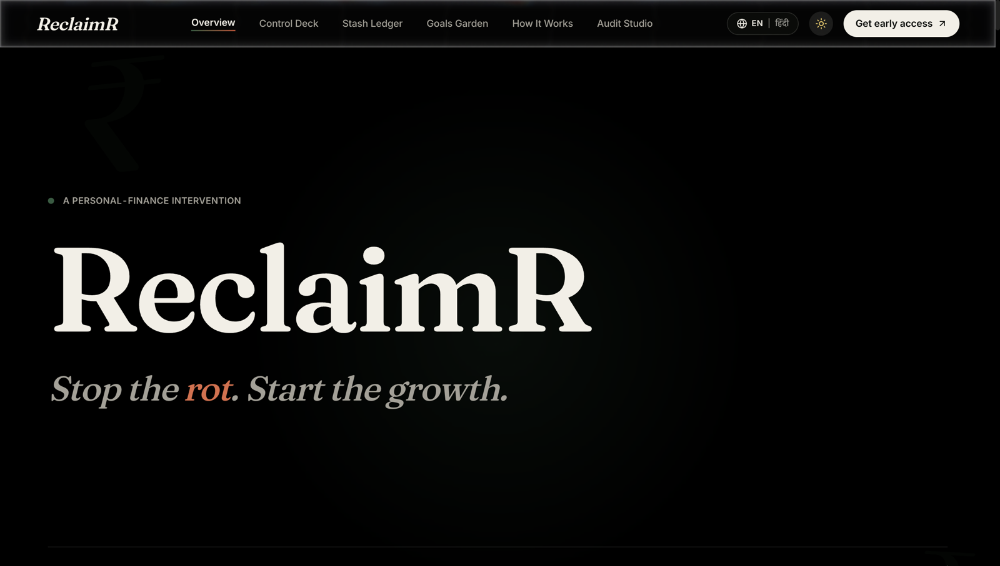

<div align="center">

  

  # ReclaimR

  ### *Stop the Rot. Start the Growth.*

  [](https://react.dev/)
  [](https://www.typescriptlang.org/)
  [](https://vitejs.dev/)
  [](https://tailwindcss.com/)
  [](https://gsap.com/)
  [](https://lenis.darkroom.engineering/)
  [](https://react.i18next.com/)
  [](LICENSE)

  <p align="center">
    <strong>On-device financial intervention that detects forgotten UPI AutoPay mandates and compounds the reclaimed cash into Nifty 50 SIPs.</strong>
  </p>

  <p align="center">
    <a href="https://vercel.com/new/clone?repository-url=https%3A%2F%2Fgithub.com%2Fvedpatel54116%2FReclaimR">
      
    </a>
  </p>

</div>

---

## Overview

**ReclaimR** is an editorial-grade personal finance app built to fight the silent erosion of household wealth caused by forgotten subscription trials, neglected SaaS tools, and recurring UPI AutoPay mandates.

Bank e-mandates are parsed **entirely on-device** — zero cloud uploads. Users can revoke mandates via direct NPCI PSP termination (no merchant retention dark patterns) and route every reclaimed rupee into high-yield Nifty 50 Index SIPs.

---

## Features

- **On-device mandate audit** — local SMS and e-mandate parsing with complete data privacy.
- **1-tap AutoPay revocation** — direct NPCI PSP mandate termination, bypassing merchant retention flows. Cancelled subscriptions are marked *diverted* and their cost is routed into your primary SIP goal automatically.
- **Leak calculator** — real-time simulator computing 10-year micro-SIP compounding at 12% CAGR.
- **Full app suite** — dashboard, subscription list/detail, goals garden, alerts timeline, monthly recovery report, onboarding wizard, login, and settings screens, all client-side with `localStorage` persistence (demo data, no backend required).
- **Lenis scroll engine** — 60 FPS inertia scrolling synchronized with GSAP ScrollTrigger, lazy-loaded routes, and split vendor chunks.
- **Light & dark themes** — token-driven theming (`tokens.css`) with a one-click toggle, plus instant English / Hindi (`EN | हिंदी`) i18n with `localStorage` persistence.
- **Early-access waitlist** — serverless waitlist backed by Supabase with Resend welcome e-mails (degrades gracefully without API keys).
- **Dynamic OG images** — `/api/og` edge-renders 1200×630 social cards.
- **Accessibility** — WCAG AA contrast, visible focus states, skip link, and full `prefers-reduced-motion` fallbacks.
- **"Rot" glitch easter egg** — a tactile visual easter egg triggered by keyboard interaction.

---

## Screenshots

<div align="center">
  
  
  
  
</div>

---

## Tech Stack

| Layer | Technology | Version |
|---|---|---|
| **Framework** | [React](https://react.dev/) + [TypeScript](https://www.typescriptlang.org/) + [Vite](https://vitejs.dev/) | 19.0 / 5.8 / 6.2 |
| **Styling** | [Tailwind CSS v4](https://tailwindcss.com/) (`@tailwindcss/vite`) + CSS custom properties | 4.1 |
| **Animation** | [GSAP](https://gsap.com/) + ScrollTrigger + [Lenis](https://lenis.darkroom.engineering/) + Split-Type | 3.15 / 1.3 |
| **Routing** | [React Router](https://reactrouter.com/) | 7.18 |
| **Icons & fonts** | [Lucide](https://lucide.dev/) + Fraunces & Inter variable fonts (`@fontsource-variable`) | 0.546 |
| **i18n** | [react-i18next](https://react.i18next.com/) (`en`, `hi`) | i18next 26.3 |
| **Backend** | Vercel serverless (`/api/waitlist`, `/api/og`) + [Supabase](https://supabase.com/) + [Resend](https://resend.com/) | — |
| **Analytics** | [Umami](https://umami.is/) (privacy-first custom events) | — |

---

## Project Structure

```
├── index.html          # HTML shell, SEO metadata, Umami script
├── src/
│   ├── main.tsx        # React root renderer
│   ├── App.tsx         # Router, providers, site chrome (lazy-loaded routes)
│   ├── types.ts        # Subscription / Goal / RotAlert / UserProfile models
│   ├── context/        # AppContext — app state + localStorage persistence
│   ├── data/           # Mock subscriptions, goals, alerts, agent personalities
│   ├── screens/        # 15 route pages (Dashboard, Subscriptions, Goals, …)
│   ├── components/     # Landing sections, charts (charts/), UI primitives (ui/)
│   ├── theme/          # tokens.css + tokens.ts design tokens (light/dark)
│   ├── motion/, lib/   # Scroll primitives, Lenis/GSAP provider, analytics
│   ├── i18n/           # en.json / hi.json translations
│   └── utils/          # finance.ts — SIP & compounding math (single source of truth)
├── api/                # Vercel serverless functions (waitlist.ts, og.tsx)
├── public/             # Static assets, manifest, robots.txt, sitemap
├── shots/              # UI screenshots used in this README
└── docs/               # Design specs and implementation plans
```

---

## Getting Started

### Prerequisites

- **Node.js** `v18+`
- **npm** `v9+`

### Setup

```bash
git clone https://github.com/vedpatel54116/ReclaimR.git
cd ReclaimR
npm install
```

### Environment variables

Copy the example file and fill in your keys:

```bash
cp .env.example .env.local
```

```env
SUPABASE_URL=https://your-project-ref.supabase.co
SUPABASE_ANON_KEY=your-supabase-anon-key-here
RESEND_API_KEY=re_123456789_your_resend_api_key_here
```

### Scripts

| Command | Description |
|---|---|
| `npm run dev` | Start dev server on `http://localhost:3000` |
| `npm run build` | Production build to `dist/` |
| `npm run preview` | Preview the production build |
| `npm run lint` | Type-check with `tsc --noEmit` |

---

## Deployment

Optimized for [Vercel](https://vercel.com/) — see [`vercel.json`](vercel.json). The `api/` directory deploys automatically as serverless functions, and `/api/og` generates dynamic OG images.

[](https://vercel.com/new/clone?repository-url=https%3A%2F%2Fgithub.com%2Fvedpatel54116%2FReclaimR)

---

## Roadmap

- [x] **Q1 2026** — On-device e-mandate scanner, Leak Calculator, editorial landing experience.
- [x] **Q1 2026** — Serverless waitlist, Resend dispatch, bilingual i18n.
- [ ] **Q2 2026** — Account Aggregator (AA) live bank sync: HDFC, ICICI, SBI, Axis Bank.
- [ ] **Q3 2026** — Zero-touch UPI AutoPay revocation via NPCI PSP APIs.
- [ ] **Q4 2026** — Multi-asset micro-SIP engine (Nifty 50, Gold ETF, Debt Funds).

---

## Contributing

1. Fork the repo and create a branch (`git checkout -b feature/your-idea`).
2. Make your changes and run `npm run lint && npm run build`.
3. Commit, push, and open a pull request describing what changed and why.

---

## License

Distributed under the MIT License. See [`LICENSE`](LICENSE) for details.

---

<div align="center">
  <sub>Built for monetary sovereignty in India · © 2026 ReclaimR</sub>
</div>
